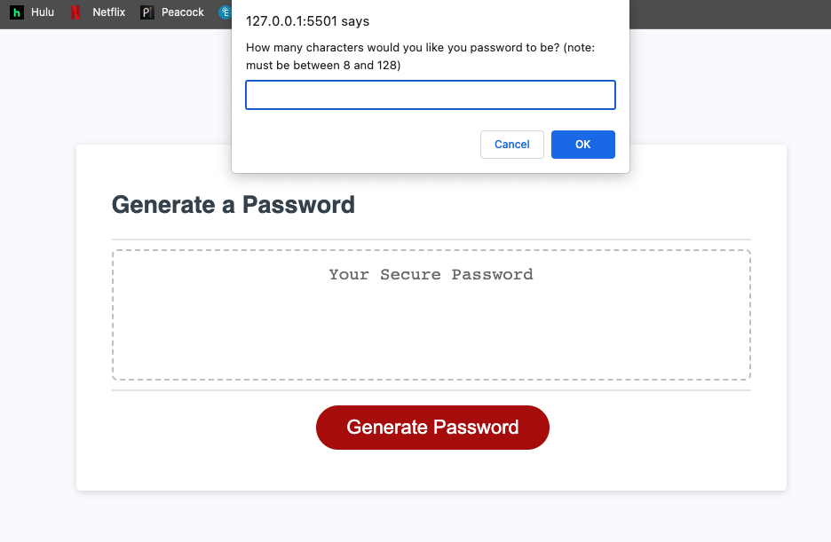

# password-generator
Challenge 3, Javascript

## Information
User Story of this project: 
To randomly generate a password that meets certain criteria per user preference
To create a strong password that provides greater security

## Description
This webpage allows users to generate a password. The webpage opens to a page titles Password Generator with a red button to "generate Password". There will then be a window prompt that will ask a series of questions in terms of user preferences. These questions include number of characters in the password, if the user would like uppercase characters, lowercase characters, numeric values and special characters. Once each prompt has been answered with a "y" or "m" in response to the question, the webpage will output a password in the area specified. At thus point the user now has a random password generated per his/her preference in character set. 

## Usage 
No downloads are necessitated to utilize this password generator. This is a deployed webpage application that may be used via any Web browser. 

## Links
You may access the deployed application at: 
 https://shaffachaudhry.github.io/password-generator/

you may access the repository at: 
https://github.com/shaffachaudhry/password-generator

## Sources Utilized 
Multiple sources were used to help in the functionality of the website to include 
-Class Activities Module 3 Java Script
-Student Mini Project 
-https://developer.mozilla.org/en-US/docs/Web/JavaScript/Reference/Global_Objects/Array
-https://developer.mozilla.org/en-US/docs/Web/JavaScript/Reference
-https://developer.mozilla.org/en-US/docs/Web/JavaScript/Reference/Statements/while

## Mock Image

